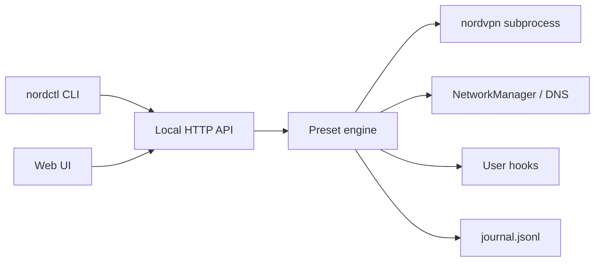

<!-- nordctl-src-id:NCTL-src-a7f3c912-6e4b-5d8a -->
# nordctl

[](LICENSE)
[](https://www.python.org/downloads/)
[](https://github.com/G4EA5/nordctl/actions/workflows/ci.yml)
[](https://pypi.org/project/nordctl/)

**One command, any scenario** — preset-driven NordVPN control for Linux with a local web UI, leak lab, snapshots, and WiFi automation.

> Independent open-source project (MIT). Not affiliated with Nord Security. See [LEGAL.md](LEGAL.md).

---

## Quick start (5 steps)

| Step | What to do |
|------|------------|
| **1. Install nordctl** | `pip install nordctl` or clone + `./install.sh` |
| **2. Install & login NordVPN** | `nordctl install-nordvpn` then `nordvpn login` |
| **3. Initialize** | `nordctl init` — creates config, picks UI port, minimal VPN profile |
| **4. Apply a preset** | `nordctl apply streaming-smartdns` (or `full-vpn`, `meshnet-only`, …) |
| **5. Open the UI** | `nordctl serve` → http://127.0.0.1:8765/ |

Edit `~/.config/nordctl/config.yaml` first — set `connect_country` and `wifi.profiles` for Smart DNS.

**No Nord account yet?** Try `nordctl demo` to explore the UI with simulated state.

```bash
pip install 'nordctl[tray]'    # optional system tray
nordctl doctor                  # readiness check
nordctl apply --dry-run full-vpn   # preview before applying
```

---

## Why nordctl?

| | **nordvpn CLI** | **NordVPN GUI** | **nordctl** |
|---|:---:|:---:|:---:|
| One-shot connect/disconnect | ✓ | ✓ | ✓ |
| **Scenario presets** (streaming, travel, mesh-only, …) | — | limited | ✓ 58 built-in |
| **Smart DNS + WiFi** profile sync | manual | partial | ✓ |
| **Leak & DNS lab** | — | — | ✓ |
| **Snapshots / rollback** | — | — | ✓ |
| **WiFi zones** (SSID → preset) | — | — | ✓ |
| **Split tunnel / allowlist UI** | CLI only | partial | ✓ |
| **Local web dashboard + API** | — | ✓ | ✓ |
| **Headless / Home Assistant** | scripts | — | ✓ REST |
| **100% local, no telemetry** | ✓ | ✓ | ✓ |
| Linux CLI / automation | ✓ | — | ✓ |

nordctl wraps the official NordVPN client — it does not replace your subscription or bypass provider terms.

---

## Install

### PyPI (recommended)

```bash
pip install --user nordctl
pip install 'nordctl[tray]'   # optional: system tray icon

nordctl init
nordctl serve
```

### From source

```bash
git clone https://github.com/G4EA5/nordctl.git
cd nordctl
./install.sh
# optional: ./install.sh --install-nordvpn
```

### Packaging

| Format | Command |
|--------|---------|
| **Debian/Ubuntu .deb** | `bash scripts/build-deb.sh` → `dist/nordctl_*.deb` |
| **Arch (AUR template)** | [packaging/arch/PKGBUILD](packaging/arch/PKGBUILD) |
| **Uninstall** | `bash scripts/uninstall.sh [--purge-config]` |

PyPI releases are published on [GitHub Release](https://github.com/G4EA5/nordctl/releases) via CI.

---

## Architecture



Details: [docs/ARCHITECTURE.md](docs/ARCHITECTURE.md) · API: [docs/openapi.yaml](docs/openapi.yaml) · Hooks: [docs/HOOKS.md](docs/HOOKS.md)

**Planned first-run UX:** minimal install choice (Nord focus / Network & Security / nordctl only), then a dashboard **welcome wizard** for WiFi, country, and the rest — see [docs/INSTALL_WIZARD.md](docs/INSTALL_WIZARD.md) (design only; not built yet).

---

## Features (v0.2)

- **Dashboard** — presets, Smart DNS hub, setup wizard, doctor
- **Lab** — leak tests, network audit, anonymized support bundle
- **Automate** — WiFi zones, schedules, snapshots, [preset hooks](docs/HOOKS.md)
- **Connection journal** — `nordctl journal` / `GET /api/journal`
- **Community presets** — import YAML from URL
- **Demo mode** — `nordctl demo` (no Nord account)
- **Home Assistant** — `GET /api/ha/state`

Full preset catalog: [presets/README.md](presets/README.md)

---

## Requirements

- Linux + **NetworkManager** (`nmcli`, `resolvectl`) for Smart DNS presets  
- **Python 3.10+**  
- **NordVPN CLI** + subscription for VPN presets (`nordctl install-nordvpn`)  
- macOS not supported (different network stack)

Compatibility matrix: [docs/COMPATIBILITY.md](docs/COMPATIBILITY.md)

---

## Configuration

Copy [config.example.yaml](config.example.yaml). All personal data stays in `~/.config/nordctl/`.

**Preset hooks:** executable scripts in `~/.config/nordctl/hooks/pre-preset/` and `post-preset/`.

### Top bar IP addresses (Home / VPN / Mesh)

The dashboard top bar shows how traffic leaves this PC:

| Chip | Meaning |
|------|---------|
| **Home** or **Public** | Your ISP address on the current WiFi (or wired) network |
| **VPN** | Nord exit IP while the tunnel is up |
| **Mesh** | Nord Meshnet address on this device (when Meshnet is on) |

**Travel-safe by default:** with VPN on, the Home chip appears only on **home WiFi** — not at hotels or cafés. Home WiFi is any SSID in `wifi.profiles` or `wifi_zones.trusted`.

**One-time setup at home:**

1. Add your home connection names to `wifi.profiles` (WiFi tab → Profiles → **Add to config**).
2. Disconnect VPN once on home WiFi — nordctl auto-learns your ISP IP per network into `~/.config/nordctl/home_ip_cache.json`.
3. Optional: add `home_public_ip` on a trusted zone if your ISP IP is fixed and you never want to re-learn.

While traveling, unknown SSIDs show **VPN** and **Mesh** only — your home ISP address stays hidden. Hover the top bar for details.

See [docs/ARCHITECTURE.md](docs/ARCHITECTURE.md#ip-display-home--public--vpn--mesh) and in-app **Help → Top bar IP addresses**.

---

## Legal

Streaming presets change **local DNS/VPN settings only**. You must comply with Nord terms, streaming service terms, and local law. See [LEGAL.md](LEGAL.md).

---

## Before GitHub

Run `bash scripts/audit-public.sh` and follow [docs/PUBLISH_CHECKLIST.md](docs/PUBLISH_CHECKLIST.md). Personal settings (WiFi names, mesh peers, countries) belong only in `~/.config/nordctl/` — never in the repo.

---

## Development

```bash
python3 -m venv .venv && source .venv/bin/activate
pip install -e '.[dev]'
bash scripts/selftest.sh
nordctl serve
```

## License

MIT — see [LICENSE](LICENSE). Changelog: [CHANGELOG.md](CHANGELOG.md).
