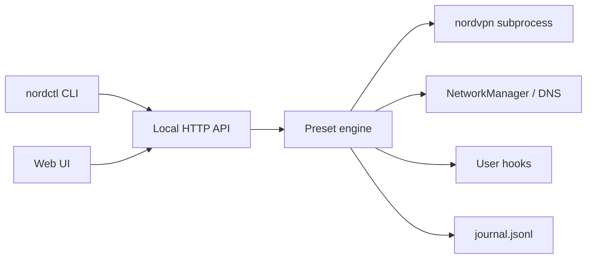

<!-- nordctl-src-id:NCTL-src-a7f3c912-6e4b-5d8a -->
# nordctl

[](LICENSE)
[](https://www.python.org/downloads/)
[](https://github.com/G4EA5/nordctl/actions/workflows/ci.yml)
[](https://pypi.org/project/nordctl/)

**One command, any scenario** — preset-driven NordVPN control for Linux with a local web UI, leak lab, snapshots, and WiFi automation.

> Independent open-source project (MIT). Not affiliated with Nord Security. See [LEGAL.md](LEGAL.md).

---

## Quick start

**Recommended — one command installs everything** (CLI, dashboard, presets, config, UI at login):

```bash
git clone https://github.com/G4EA5/nordctl.git
cd nordctl
./install.sh
```

The installer shows **one optional checklist** (NordVPN client, dashboard at login, open browser), then opens the dashboard. Use the top-bar **Wizard** for Nord login, WiFi, country, and your first preset — not the terminal.

| After install | What to do |
|---------------|------------|
| **Wizard** | Nord login, WiFi sync, home country, optional Smart DNS |
| **Connect** | Pick a preset (e.g. streaming Smart DNS) or connect from the dashboard |
| **No Nord account?** | `nordctl demo` — explore the UI with simulated state |

```bash
nordctl doctor                      # readiness check
nordctl apply --dry-run full-vpn    # preview before applying
```

**Manual install** (PyPI, packagers, scripts): `pip install nordctl` then `nordctl init` and `nordctl service bootstrap` — see [Install](#install).

---

## Why nordctl?

| | **nordvpn CLI** | **NordVPN GUI** | **nordctl** |
|---|:---:|:---:|:---:|
| One-shot connect/disconnect | ✓ | ✓ | ✓ |
| **Scenario presets** (streaming, travel, mesh-only, …) | — | limited | ✓ 58 built-in |
| **Smart DNS + WiFi** profile sync | manual | partial | ✓ |
| **Leak & DNS lab** | — | — | ✓ |
| **Snapshots / rollback** | — | — | ✓ |
| **WiFi zones** (SSID → preset) | — | — | ✓ |
| **Split tunnel / allowlist UI** | CLI only | partial | ✓ |
| **Local web dashboard + API** | — | ✓ | ✓ |
| **Headless / Home Assistant** | scripts | — | ✓ REST |
| **100% local, no telemetry** | ✓ | ✓ | ✓ |
| Linux CLI / automation | ✓ | — | ✓ |

nordctl wraps the official NordVPN client — it does not replace your subscription or bypass provider terms.

---

## Screenshots

UI captures from demo mode where possible ([full gallery](docs/screenshots/README.md)).

### Nord Dashboard

| Connect | Switches | Workflows |
|:---:|:---:|:---:|
|  |  |  |

| Meshnet | Nord shell | Scenario presets |
|:---:|:---:|:---:|
|  |  |  |

| Favorites |
|:---:|
|  |

### Networking

| WiFi | Internet traffic | Local traffic |
|:---:|:---:|:---:|
|  |  |  |

| Live bandwidth | Speed test | Routes & DNS |
|:---:|:---:|:---:|
|  |  |  |

| Services | Packages | WiFi spectrum |
|:---:|:---:|:---:|
|  |  |  |

### Security

| Overview | Doctors | Leak tests |
|:---:|:---:|:---:|
|  |  |  |

| Audit | UFW | Packages |
|:---:|:---:|:---:|
|  |  |  |

| Privileges |
|:---:|
|  |

### Tools, Help & Settings

| Guide | Logs | Editor |
|:---:|:---:|:---:|
|  |  |  |

| Help | Settings |
|:---:|:---:|
|  |  |

---

## Install

### From source (recommended)

```bash
git clone https://github.com/G4EA5/nordctl.git
cd nordctl
./install.sh    # complete package — venv, CLI, dashboard, init, optional NordVPN
```

One screen before install: optional NordVPN client, start dashboard at login, open browser. Everything else is in the dashboard **Wizard**. Details: [docs/INSTALL_WIZARD.md](docs/INSTALL_WIZARD.md).

### Debian/Ubuntu (.deb)

Build and install locally (adds an **nordctl** entry in your app menu):

```bash
git clone https://github.com/G4EA5/nordctl.git
cd nordctl
bash scripts/build-deb.sh
sudo apt install ./dist/nordctl_*_all.deb
```

Open **nordctl** from the application menu (or run `nordctl-open`). First launch creates config, starts the dashboard, opens the browser, and enables the UI at user login. Uninstall: `sudo apt remove nordctl` (keeps `~/.config/nordctl/`).

### PyPI (manual steps)

For advanced users or packaging — you run init and start the UI yourself:

```bash
pip install --user nordctl
pip install 'nordctl[tray]'   # optional: system tray icon

nordctl init
nordctl service bootstrap   # or: nordctl serve
nordctl install-nordvpn     # optional, separate step
```

### Packaging

| Format | Command |
|--------|---------|
| **Debian/Ubuntu .deb** | `bash scripts/build-deb.sh` → `dist/nordctl_*.deb` — adds **nordctl** app menu launcher |
| **Arch (AUR template)** | [packaging/arch/PKGBUILD](packaging/arch/PKGBUILD) |
| **Uninstall** | `bash scripts/uninstall.sh [--purge-config]` |

PyPI releases are published on [GitHub Release](https://github.com/G4EA5/nordctl/releases) via CI.

---

## Architecture



Details: [docs/ARCHITECTURE.md](docs/ARCHITECTURE.md) · API: [docs/openapi.yaml](docs/openapi.yaml) · Hooks: [docs/HOOKS.md](docs/HOOKS.md)

**First run:** `./install.sh` installs the full stack; the dashboard **Wizard** (`#dashboard/wizard`) covers WiFi, country, Nord login, and presets — [docs/INSTALL_WIZARD.md](docs/INSTALL_WIZARD.md).

---

## Features (v0.2)

- **Dashboard** — presets, Smart DNS hub, setup wizard, doctor
- **Networking** — WiFi hub, traffic maps, live bandwidth, **WiFi spectrum** (band filters + SSID picker), Bluetooth spectrum
- **Lab** — leak tests, network audit, anonymized support bundle
- **Automate** — WiFi zones, schedules, snapshots, [preset hooks](docs/HOOKS.md)
- **Connection journal** — `nordctl journal` / `GET /api/journal`
- **Community presets** — import YAML from URL
- **Demo mode** — `nordctl demo` (no Nord account)
- **Home Assistant** — `GET /api/ha/state`

Full preset catalog: [presets/README.md](presets/README.md)

---

## Requirements

- Linux + **NetworkManager** (`nmcli`, `resolvectl`) for Smart DNS presets  
- **Python 3.10+**  
- **NordVPN CLI** + subscription for VPN presets (`nordctl install-nordvpn`)  
- macOS not supported (different network stack)

Compatibility matrix: [docs/COMPATIBILITY.md](docs/COMPATIBILITY.md)

---

## Configuration

Copy [config.example.yaml](config.example.yaml). All personal data stays in `~/.config/nordctl/`.

**Preset hooks:** executable scripts in `~/.config/nordctl/hooks/pre-preset/` and `post-preset/`.

### Top bar IP addresses (Home / VPN / Mesh)

The dashboard top bar shows how traffic leaves this PC:

| Chip | Meaning |
|------|---------|
| **Home** or **Public** | Your ISP address on the current WiFi (or wired) network |
| **VPN** | Nord exit IP while the tunnel is up |
| **Mesh** | Nord Meshnet address on this device (when Meshnet is on) |

**Travel-safe by default:** with VPN on, the Home chip appears only on **home WiFi** — not at hotels or cafés. Home WiFi is any SSID in `wifi.profiles` or `wifi_zones.trusted`.

**One-time setup at home:**

1. Add your home connection names to `wifi.profiles` (WiFi tab → Profiles → **Add to config**).
2. Disconnect VPN once on home WiFi — nordctl auto-learns your ISP IP per network into `~/.config/nordctl/home_ip_cache.json`.
3. Optional: add `home_public_ip` on a trusted zone if your ISP IP is fixed and you never want to re-learn.

While traveling, unknown SSIDs show **VPN** and **Mesh** only — your home ISP address stays hidden. Hover the top bar for details.

See [docs/ARCHITECTURE.md](docs/ARCHITECTURE.md#ip-display-home--public--vpn--mesh) and in-app **Help → Top bar IP addresses**.

---

## Legal

Streaming presets change **local DNS/VPN settings only**. You must comply with Nord terms, streaming service terms, and local law. See [LEGAL.md](LEGAL.md).

---

## Before GitHub

Run `bash scripts/audit-public.sh` and follow [docs/PUBLISH_CHECKLIST.md](docs/PUBLISH_CHECKLIST.md). Personal settings (WiFi names, mesh peers, countries) belong only in `~/.config/nordctl/` — never in the repo.

---

## Development

```bash
python3 -m venv .venv && source .venv/bin/activate
pip install -e '.[dev]'
bash scripts/selftest.sh
nordctl serve
```

## License

MIT — see [LICENSE](LICENSE). Forking & attribution: [OPEN_SOURCE.md](OPEN_SOURCE.md).
