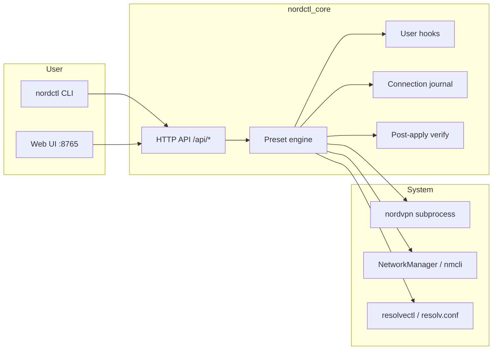

<!-- nordctl-src-id:NCTL-src-a7f3c912-6e4b-5d8a -->
# Architecture

nordctl is a local control layer on top of the NordVPN CLI and Linux network stack. Nothing runs in the cloud.

## Data flow



## Components

| Layer | Role |
|-------|------|
| **CLI / Web UI** | Human interface; same backend |
| **Preset engine** | YAML workflows → ordered steps (`nordvpn_set`, `network_smart_dns`, …) |
| **actions.py** | Executes each step safely (allowlisted `nordvpn` subcommands only) |
| **Snapshots** | Auto backup before preset apply; rollback |
| **Leak lab** | DNS / routing checks independent of presets |
| **Hooks** | User scripts in `~/.config/nordctl/hooks/` (optional) |
| **Journal** | Local JSONL of preset applies (`journal.jsonl`) |
| **ip_info / home_ip** | Top-bar IP chain: ISP, VPN exit, Meshnet (`home_ip.py`, `ip_info.py`) |

## IP display (Home / Public / VPN / Mesh)

The web UI top bar and `GET /api/state/network` → `ip_info.chain` show up to three roles:

```text
Home 203.0.113.1  →  VPN 198.51.100.2  ·  Mesh 100.x.x.x
```

| Role | Source | When shown |
|------|--------|------------|
| **Home / Public** | Live fetch (VPN off), per-SSID cache, zone `home_public_ip`, or LAN-side probe on home WiFi | Hidden on untrusted travel WiFi when VPN is on (default) |
| **VPN** | `nordvpn status` exit IP | VPN connected |
| **Mesh** | Meshnet local IP | Meshnet enabled |

**What counts as home WiFi** (for showing Home while VPN is on):

- SSID listed in `wifi_zones.trusted`, or
- SSID matching a name in `wifi.profiles` (NetworkManager connection names you added for Smart DNS)

**Auto-learn:** when VPN is off, nordctl stores the live public IP per SSID in `~/.config/nordctl/home_ip_cache.json` (if `wifi_zones.home_ip_learn: true`). That cached value is reused on the same network later — even with kill switch blocking a fresh ISP probe.

**Config keys** (`config.example.yaml`):

- `wifi_zones.home_ip_when_trusted` — default `true`; set `false` to always attempt Home display (not recommended when traveling)
- `wifi_zones.home_ip_learn` — default `true`; disable to stop writing the cache
- `wifi_zones.trusted[].home_public_ip` — optional fixed ISP for that SSID only (travel-safe; no global `known_home_ip` needed)

**Why not show default-route IP while VPN is on?** A plain `curl ifconfig.me` often returns a Nord relay or tunnel artifact, not your real ISP. nordctl only uses a LAN-interface probe on home networks, or cached/config values.

## Preset apply sequence

1. Validate preset + config requirements  
2. Run **pre-preset** hooks (may block)  
3. Optional snapshot  
4. Execute steps (Nord CLI + NetworkManager)  
5. Post-apply verification (DNS, IP, routing)  
6. Run **post-preset** hooks  
7. Append **connection journal** entry  

## Security model

- UI binds to `127.0.0.1` by default  
- Optional dashboard password for LAN access  
- No telemetry; optional email uses **your** SMTP only  
- Support bundles can be exported **anonymized** for GitHub issues  

See [HOOKS.md](HOOKS.md) and [openapi.yaml](openapi.yaml).

## First-run experience (planned)

Install should ask only **which product shape** the user wants (Nord focus, Network & Security only, or nordctl-only CLI). Detailed setup — WiFi profiles, country, Nord login, home ISP, presets — belongs in a **welcome wizard** on first dashboard open, not in help docs or install prompts.

Full design: [INSTALL_WIZARD.md](INSTALL_WIZARD.md).
